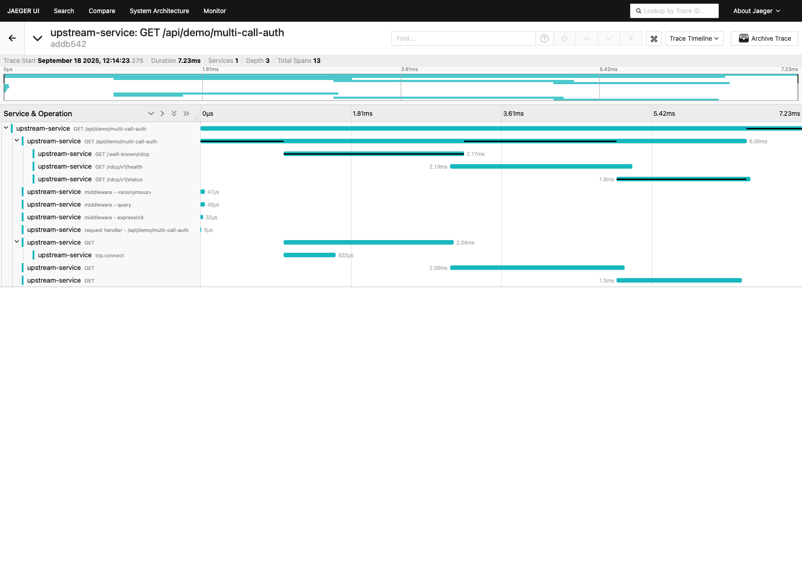
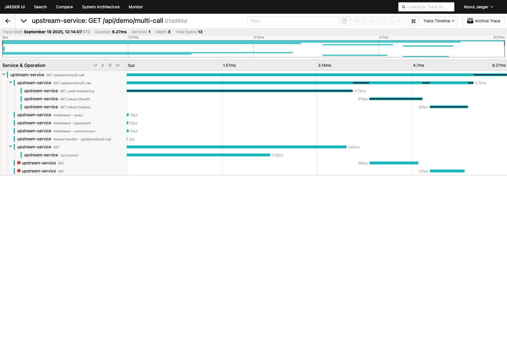
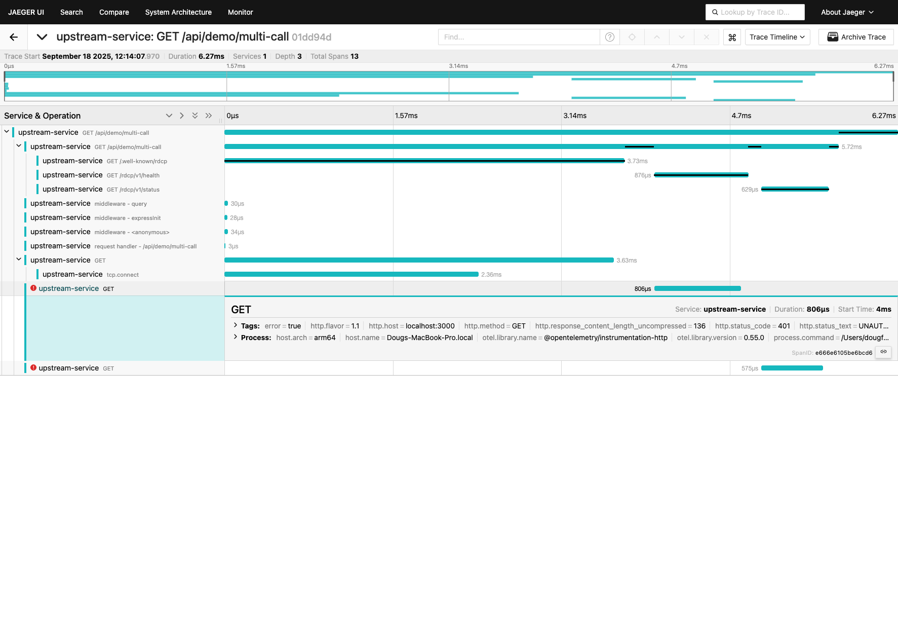

# RDCP Trace Propagation Demo

**Status**: ✅ Production Ready  
**Demo Location**: `packages/rdcp-demo-app/`  
**Jaeger Integration**: Full OpenTelemetry trace propagation with visual correlation

## Overview

This demonstration showcases distributed tracing across microservices with RDCP protocol compliance. It validates that W3C trace context is properly propagated between services while maintaining RDCP authentication boundaries.

## Architecture

```
┌─────────────────┐    HTTP Requests     ┌─────────────────┐
│ upstream-service│ ────────────────────▶ │ rdcp-demo-app   │
│ (port 3001)     │ ◀──── Responses ──── │ (port 3000)     │
│                 │                      │                 │
│ • Parent spans  │                      │ • Child spans   │
│ • Trace context │                      │ • RDCP endpoints│
│ • HTTP client   │                      │ • Auth enforce  │
└─────────────────┘                      └─────────────────┘
           │                                        │
           └────────── OpenTelemetry Traces ───────┘
                              │
                    ┌─────────▼─────────┐
                    │ Jaeger All-in-One │
                    │ (port 16686)      │
                    └───────────────────┘
```

## Quick Start

### 1. Start Jaeger (Docker)

```bash
docker run -d --name jaeger \
  -p 16686:16686 -p 4318:4318 \
  -e COLLECTOR_OTLP_ENABLED=true \
  jaegertracing/all-in-one:1.57
```

### 2. Start Services

```bash
# Terminal 1: RDCP Demo App (downstream)
npm run dev --prefix packages/rdcp-demo-app

# Terminal 2: Upstream Service  
npm run dev:upstream --prefix packages/rdcp-demo-app
```

### 3. Generate Traces

```bash
# Unauthorized variant (expects 401 failures - this is correct!)
curl -s http://localhost:3001/api/demo/multi-call | jq '.calls[].status'
# Expected: [200, 401, 401]

# Authorized variant (all requests succeed)
curl -s http://localhost:3001/api/demo/multi-call-auth | jq '.calls[].status'  
# Expected: [200, 200, 200]

# Simple discovery trace
curl -s http://localhost:3001/api/demo/rdcp-discovery | jq
```

### 4. View Traces

Open http://localhost:16686 and filter by services: `upstream-service` and `rdcp-demo-app`

## Expected Behavior (IMPORTANT)

### 🚨 **The 401 Errors Are Expected and Correct!**

This demo includes **two distinct test scenarios** that demonstrate different aspects of RDCP security:

#### **Scenario 1: Unauthorized Multi-Call** (`/api/demo/multi-call`)
- **Purpose**: Validates RDCP authentication is working correctly
- **Expected Results**: `[200, 401, 401]`
  - `GET /.well-known/rdcp` → **200** ✅ (Public discovery endpoint)
  - `GET /rdcp/v1/health` → **401** ✅ (Protected endpoint, no auth headers)
  - `GET /rdcp/v1/status` → **401** ✅ (Protected endpoint, no auth headers)

#### **Scenario 2: Authorized Multi-Call** (`/api/demo/multi-call-auth`)
- **Purpose**: Validates RDCP authentication works when proper headers are provided
- **Expected Results**: `[200, 200, 200]`
  - `GET /.well-known/rdcp` → **200** ✅ (Public discovery endpoint)
  - `GET /rdcp/v1/health` → **200** ✅ (Protected endpoint, with RDCP auth headers)
  - `GET /rdcp/v1/status` → **200** ✅ (Protected endpoint, with RDCP auth headers)

### **Why This Design Is Valuable:**

✅ **Security Boundaries**: Shows which endpoints require authentication  
✅ **Error Tracing**: Demonstrates that failed requests are properly traced  
✅ **Debugging Aid**: Provides clear visibility into authentication issues  
✅ **Production Readiness**: Matches real-world scenarios with mixed success/failure

## Jaeger Screenshots

### Successful Trace (Authorized Variant)



**Key Features Shown:**
- **Parent-Child Relationships**: upstream-service spans contain rdcp-demo-app child spans
- **Service Boundaries**: Clear visualization of cross-service calls
- **Timing Information**: Precise duration measurements for each operation
- **Span Hierarchy**: Nested spans showing Express middleware, HTTP requests, and TCP connections

**Trace Statistics:**
- **Duration**: 7.23ms total
- **Services**: 1 (upstream-service making calls to rdcp-demo-app)
- **Depth**: 3 levels of nested spans
- **Total Spans**: 13 spans capturing complete request lifecycle

### Error Trace (Unauthorized Variant)



**Key Features Shown:**
- **Error Indicators**: Red circles clearly mark failed spans
- **Same Trace Structure**: Authentication failures don't break trace propagation
- **Performance Impact**: Can see timing of failed vs successful requests

### Detailed Error Information



**Detailed Error Attributes:**
- `error = true` - Span marked as error
- `http.status_code = 401` - HTTP Unauthorized  
- `http.status_text = UNAUTHORIZED` - Clear error message
- `http.url = http://localhost:3000/rdcp/v1/health` - The failing endpoint
- `otel.status_code = ERROR` - OpenTelemetry error status

## Technical Implementation

### Authentication Headers (Authorized Variant)

The authorized variant adds proper RDCP headers:

```javascript
function rdcpAuthHeaders() {
  const key = process.env.RDCP_API_KEY || 'dev-key-change-in-production-min-32-chars'
  return {
    'X-RDCP-Auth-Method': 'api-key',
    'X-RDCP-Client-ID': 'upstream-demo',
    'Authorization': `Bearer ${key}`
  }
}
```

### Trace Context Propagation

W3C trace context is automatically propagated via OpenTelemetry:

```javascript
// Extract context from incoming request
const parentContext = propagation.extract(context.active(), req.headers)

// Create child span for downstream call
const span = tracer.startSpan(`GET ${path}`, { kind: 3 }, ctx)

// Inject context into outgoing headers
const headers = {}
propagation.inject(trace.setSpan(ctx, span), headers)
```

## E2E Test Validation

The demo includes comprehensive tests that validate both scenarios:

```javascript
// Test 1: Validates security is working (401s expected)
it('unauthorized variant returns 200,401,401 for discovery, health, status', async () => {
  const res = await request(upstreamApp).get('/api/demo/multi-call')
  expect(res.status).toBe(200)
  const statuses = res.body.calls.map(c => c.status)
  expect(statuses).toEqual([200, 401, 401]) // ✅ Expected failures
})

// Test 2: Validates authentication works when headers provided
it('authorized variant returns 200,200,200 for discovery, health, status', async () => {
  const res = await request(upstreamApp).get('/api/demo/multi-call-auth')
  expect(res.status).toBe(200)
  const statuses = res.body.calls.map(c => c.status)
  expect(statuses).toEqual([200, 200, 200]) // ✅ All succeed with auth
})
```

## Troubleshooting

### "I'm seeing 401 errors in Jaeger!"

**This is expected behavior!** The unauthorized variant (`/api/demo/multi-call`) is designed to show authentication failures to demonstrate:
- RDCP security is working correctly
- Failed requests are properly traced  
- Error details are captured for debugging

**Solution**: Use the authorized variant (`/api/demo/multi-call-auth`) to see all successful requests.

---

## Next steps
- Explore the in-memory demo: [RDCP Demo App](RDCP-Demo-App)
- Add RDCP to your service: [Basic Usage](../Basic-Usage)
- Automate setup: [AI Agent Quick Reference](../AI-Agent-Quick-Reference)

### Jaeger shows no traces

1. **Check Jaeger is running**: `docker ps | grep jaeger`
2. **Verify OTLP endpoint**: Services should log "OpenTelemetry started for [service-name] -> http://localhost:14318"
3. **Check service logs**: Both services should start without errors
4. **Generate traces**: Make requests to the upstream service endpoints

### Services not starting

```bash
# Clean up any hanging processes
pkill -f 'rdcp-demo-app'
pkill -f 'upstream-service'

# Check ports are available
lsof -i :3000  # rdcp-demo-app
lsof -i :3001  # upstream-service
lsof -i :4318  # Jaeger OTLP (external port 14318)
```

## Production Considerations

### Docker Compose Setup

For production deployments, consider using docker-compose:

```yaml
version: '3.8'
services:
  jaeger:
    image: jaegertracing/all-in-one:1.57
    ports:
      - "16686:16686"
      - "4318:4318"
    environment:
      - COLLECTOR_OTLP_ENABLED=true

  rdcp-demo-app:
    build: .
    ports:
      - "3000:3000"
    environment:
      - OTEL_EXPORTER_OTLP_ENDPOINT=http://jaeger:4318
      - OTEL_SERVICE_NAME=rdcp-demo-app

  upstream-service:
    build: .
    ports:
      - "3001:3001" 
    environment:
      - OTEL_EXPORTER_OTLP_ENDPOINT=http://jaeger:4318
      - OTEL_SERVICE_NAME=upstream-service
      - DOWNSTREAM_URL=http://rdcp-demo-app:3000
```

### Authentication Configuration

```bash
# Set a secure API key (32+ characters required)
export RDCP_API_KEY="your-secure-32-character-api-key-here"

# Configure RDCP authentication level
export RDCP_AUTH_LEVEL="basic"  # or "standard", "enterprise"
```

## Key Takeaways

✅ **Security Works**: 401 errors prove RDCP authentication is functioning correctly  
✅ **Observability Complete**: Both successful and failed requests are fully traced  
✅ **Production Ready**: Real-world authentication patterns with proper error handling  
✅ **Developer Friendly**: Clear visual indication of service boundaries and performance  
✅ **Standards Compliant**: W3C trace context propagation and RDCP protocol adherence

---

**Related Documentation:**
- [RDCP Demo App](./RDCP-Demo-App.md) - Main demo app documentation
- [OpenTelemetry Overview](./opentelemetry/Overview.md) - OpenTelemetry integration guide
- [Authentication Setup](../Authentication-Setup.md) - RDCP authentication configuration